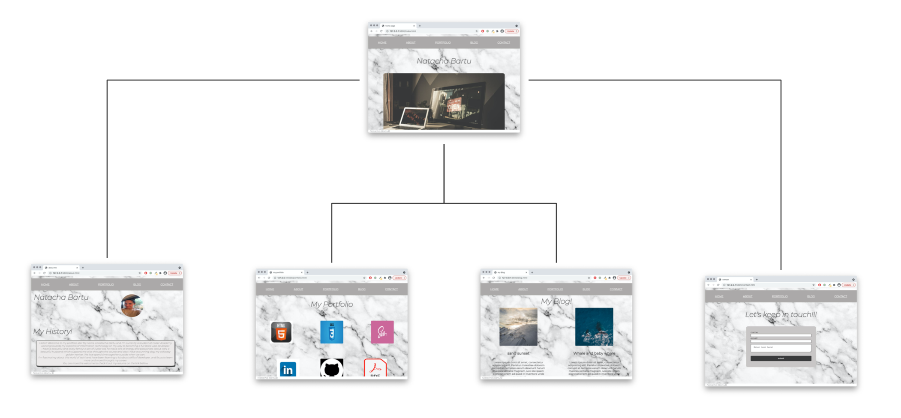
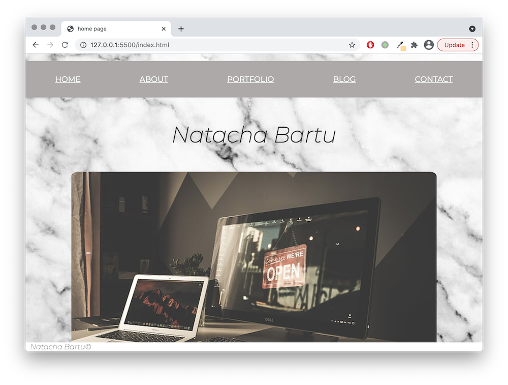
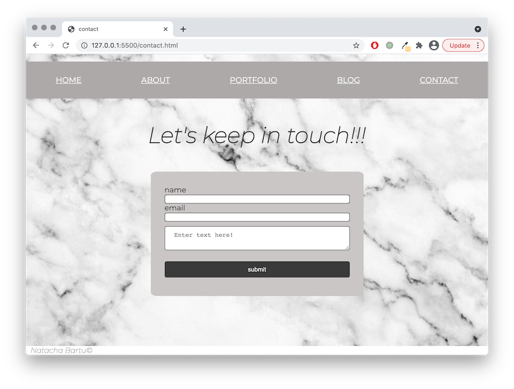
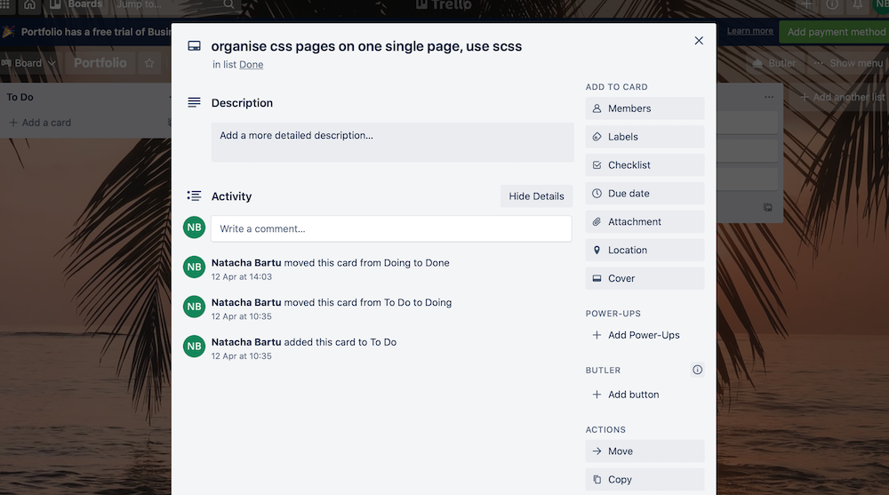

# Portfolio

## Links

1. You can visit the live [portfolio](https://natacha-bartu.netlify.app)
1. My github [repo](https://github.com/NatachaBartu/NatachaBartudaCostaPincerno_T1A2)

## Purpose

Build a webpage where I can demonstrate the skills I am learning trough the bootcamp.

## Site Map

The Picture below demonstrates the website map.

## Functionality

A static webpage which contains 5 pages:

1. Home
The landing page for people looking for a new junior developer.

1. About
The page where a talk a little bit about my history and interest.

1. Portfolio
The page where I show the skills that I've learned, my CV, github account and my linkedIn profile.

1. Blog
The page where I blog.

1. Contact
The page where people can contact me.

## Audience

This website is for anyone that is looking for a junior developer.

## Technologies

This website was build using:

1. HTML
1. scss

## Deployment

## Trello Board

A [Trello Board](https://trello.com/b/kKTmnNYE/portfolio) was used to capture my tasks.
Below there some links for trello screenshots. They were took at the end of the project, as I haven't took them at the end of the day. These screenshots try to show that the cards was created/moved in the past.

1. Card created on April 8th 
1. Card created on April 8th 
1. Card created on April 11th 
1. Card created on April 12th 
1. End Trello Board 
